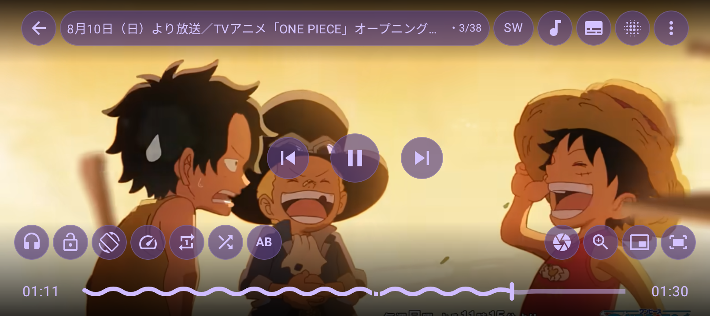
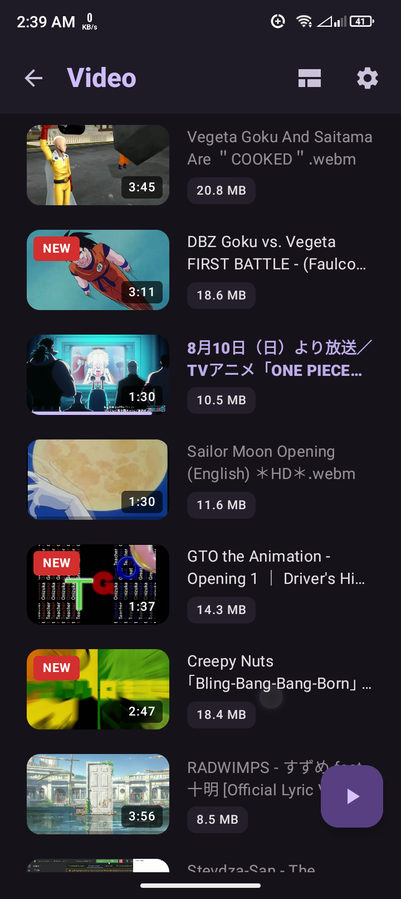
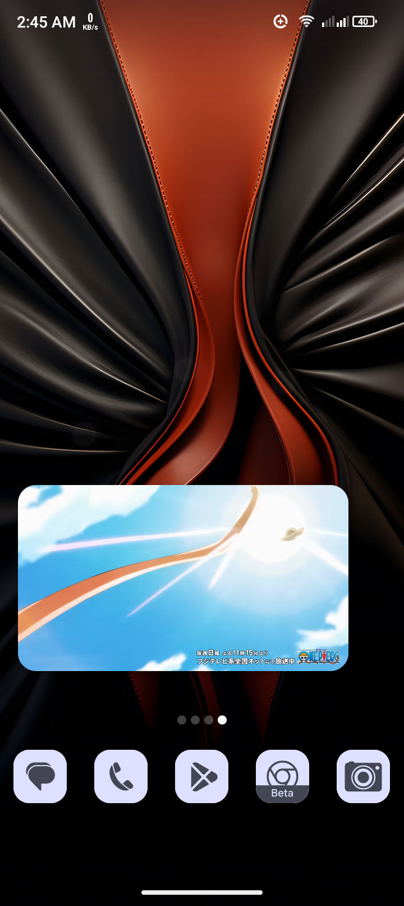
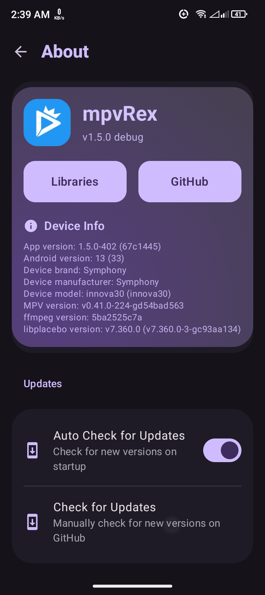
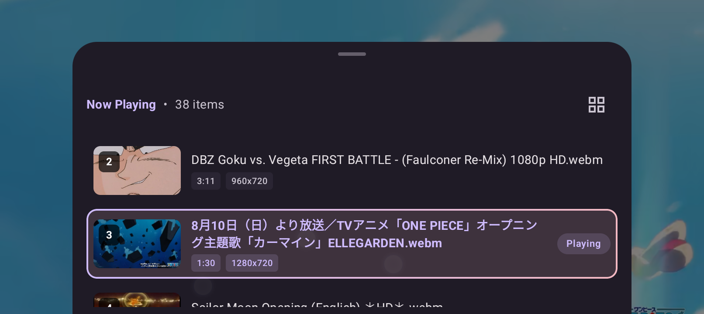
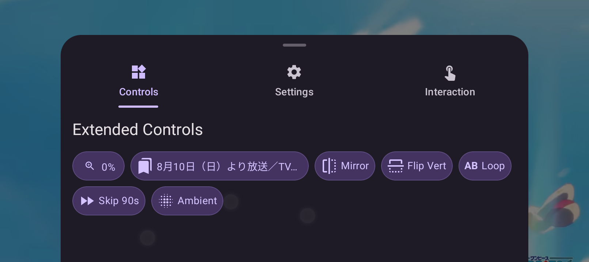

# mpvRex

  

  <b>Feature-rich Android video player based on libmpv.</b>

  
  
  
  

mpvRex is an advanced, customizable video player for Android. It combines the versatility of libmpv with a modern Jetpack Compose interface and unique user-centric features.

---

## Showcase

  

  
  
  

  
  

---

## Features

Built on top of upstream mpvEx, mpvRex extends its full feature set with targeted optimizations and new capabilities.

*   **Subtitle Swipe Seeking:** Intuitive gestures to jump between subtitle lines.
*   **Refined Tap Logic:** Enhanced single-tap response with exclusion zones and reverse double-tap options.
*   **Accidental Seek Prevention:** Optional ignore-single-tap on seekbar to prevent mistakes.
*   **Smart Orientation:** Persistent per-video orientation preferences with intelligent fallback.
*   **Themed Player Controls:** Adaptive controls that dynamically match your app theme or system accent (Material You).
*   **Shorts Mode:** Optimized vertical playback experience with auto-swipe support for "Shorts" and Reels.
*   **Audio Support:** Integrated capability to play audio files directly within the media engine.
*   **Advanced Thumbnails:** Extraction strategy choice (First Frame vs. Specific Position) and network stream previews.
*   **Modern Aesthetics:** Seamless transitions, custom branding, and specialized "Always Dark Mode" for player.
*   **Modular Architecture:** Robust Ops/Manager-driven file browser with a unified discovery engine.
*   **Unified UI:** Standardized media cards featuring reactive "NEW" badges and recursive file/folder counts.
*   **Enhanced Navigation:** Auto-scrolling synchronized chapters and support for relative seeking.
*   **Subtitle Management:** Visual indicators for primary tracks and integrated online search.

---

## Installation

  
  

  <i>Note: Previews may be unstable and are intended for testing purposes only.</i>

---

## Credits

mpvRex is a fork of **[mpvEx](https://github.com/marlboro-advance/mpvEx)** (based on **[mpv-android](https://github.com/mpv-android/mpv-android)**). Special thanks for the foundation and inspiration:

[mpvEx](https://github.com/marlboro-advance/mpvEx) • [mpv-android](https://github.com/mpv-android) • [mpvKt](https://github.com/abdallahmehiz/mpvKt) • [Next player](https://github.com/anilbeesetti/nextplayer) • [Gramophone](https://github.com/FoedusProgramme/Gramophone)

---

## License

Distributed under the **Apache License 2.0**. See `LICENSE` for more information.
