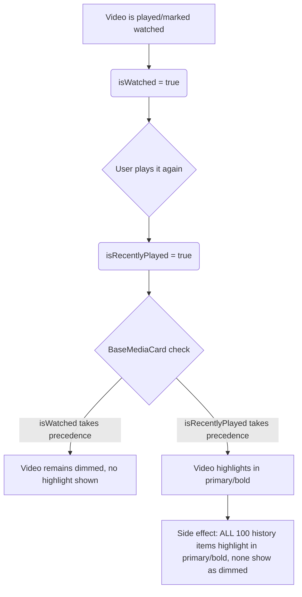

# mpvRex Media States & Visual Styling Architecture

This document maps out the full picture of the media item states in the **mpvRex** file browser. It outlines how states are stored, calculated, and visualised, diagnoses why the recent bugs occurred, and defines a robust, permanent solution.

---

## 1. Core Database Entities

Media states are derived from a combination of file metadata and two Room database entities:

### A. `PlaybackStateEntity`
Tracks the user's progress and playback parameters for individual files. Keys on the file's display name (`mediaTitle`).
* **`lastPosition` (Int):** Playback offset in seconds.
* **`timeRemaining` (Int):** Remaining duration in seconds (`duration - lastPosition`). 
  * *Sentinel value:* `-1` indicates the file was manually marked as "New".
* **`hasBeenWatched` (Boolean):** Persistent flag indicating if the video has ever crossed the watched threshold or been manually marked as "Finished".

### B. `RecentlyPlayedEntity`
Tracks the chronological history of played media items.
* **`filePath` (String):** Absolute path to the file.
* **`timestamp` (Long):** The time of playback.
* **`launchSource` (String):** Tracks how the video was opened. 
  * *Sentinel value:* `"mark_as"` indicates the item was manually marked as finished (or other states that shouldn't highlight).
  * *Sentinel value:* `"mark_as_last_played"` indicates the item was manually marked as last played (which enables highlight).

---

## 2. Media State Matrix

Here is how each individual media state is defined, evaluated, and visualised:

| State | Definition & Rationale | Evaluation Logic | UI Representation |
| :--- | :--- | :--- | :--- |
| **New** | Video added recently and never played, or manually marked as new to remind the user to watch. | `state.timeRemaining == -1` <br>OR<br> (No playback state AND `videoAge <= unplayedOldVideoDays` threshold) | Renders a red **`NEW`** badge overlay on the card. |
| **Never Played** | Video has no playback progress. Rationale: to decide whether to hide/show the progress bar. | `videoFilesWithPlayback[videoId] == null` (i.e. progress is not in the `0.01..0.99` range). | No progress bar is shown on the card. |
| **Watched** | Video has been completed. Rationale: to help the user identify already watched files by dimming them. | `state.hasBeenWatched == true` <br>OR<br> progress percentage $\ge$ `watchedThreshold` (e.g. 90%). | Title text is dimmed (`onSurface` at 60% opacity). |
| **Last Played** | The single video or batch of videos marked/played most recently (globally or within the current folder). Rationale: target for auto-scroll and main focus. | `video.path in lastPlayedVideoPathsInFolder` | Title text is highlighted in **Primary Color** and styled as **Black/Bold**. |
| **Recently Played** | (Deprecated for UI highlighting) Previously highlighted folders containing history files. Now folders only highlight if they contain the active Last Played file. | None | Neither folders nor videos use this state for highlighting anymore to prevent clutter. |

---

## 3. The Root Cause of the Highlight Conflicts

The codebase currently conflates **Recently Played** (the list of the last 100 history items) and **Last Played** (the single active file) when rendering videos. 

### How the Conflict Manifested:



1. **If `isWatched` takes precedence in `BaseMediaCard`:**
   When you play a watched video again, it is added to the history. Thus, both `isWatched = true` and `isRecentlyPlayed = true`. Because `isWatched` takes precedence, the video remains dimmed and does not highlight.
2. **If `isRecentlyPlayed` takes precedence in `BaseMediaCard`:**
   When you play a watched video again, it highlights correctly. However, because the file explorer checks `recentlyPlayedPaths.contains(video.path)` (the list of up to 100 files) instead of just the single last played path, **every single watched video in your history list is also marked as `isRecentlyPlayed = true`**. Because `isRecentlyPlayed` now takes precedence, *all of them* light up in bold/primary color, completely breaking the dimmed "watched" styling for your entire history list.

---

## 4. The Implemented Solution

To fix this permanently, we decoupled folder history highlights from video file highlights. 

### Rule 1: Videos highlight for the *Active Last Played* files (globally or per folder)
Video cards are marked as `isRecentlyPlayed = true` if they belong to the **currently active last played set** (`lastPlayedVideoPathsInFolder`). This set includes the single overall last played video OR all videos manually marked as last played by the user in the latest batch. If none are present in the folder, it falls back to the single most recent history item in that folder.
* **Why:** This ensures that folders show where the user left off (exactly one highlighted fallback if none are active), but allows marking multiple items as last played concurrently (which will all highlight globally and light up their containing folder tree).

### Rule 2: Folders only highlight for parents of the Active Last Played files
Like videos, folders are only marked as `isRecentlyPlayed = true` if they are parents (or in the directory tree path) of any active global last played paths (`recentlyPlayedFilePaths`).
* **Why:** This ensures only folders containing currently active last played items highlight, avoiding highlighting folders for old history.

### Rule 3: Visual styling precedence in `BaseMediaCard`
The visual precedence is resolved using a custom `shouldHighlight = isRecentlyPlayed && !(isWatched && isNeverPlayed)` check.
1. `shouldHighlight` $\rightarrow$ Highlight (Primary Color, Bold).
2. `isWatched` $\rightarrow$ Dimmed (60% opacity, Normal weight).
3. `else` $\rightarrow$ Default styling.

* **Mark as Finished Workflow:** When a video is marked as finished, it becomes watched (`isWatched = true`) and progress is cleared (`isNeverPlayed = true`), which forces `shouldHighlight` to `false` so it dims immediately, even if it is the last played item.
* **Rewatch Workflow:** When a previously watched video is played again, it gains active progress (`isNeverPlayed = false`), which sets `shouldHighlight` to `true` and highlights it as the active last played file.

---

## 5. Applied Implementation Details

### A. [BaseMediaCard.kt](file:///root/Projects/mpvRex/app/src/main/kotlin/xyz/mpv/rex/ui/browser/cards/BaseMediaCard.kt)
Ensure `shouldHighlight` is evaluated in both Grid and List card layout variations:
```kotlin
val shouldHighlight = isRecentlyPlayed && !(isWatched && isNeverPlayed)
color = when {
    shouldHighlight -> MaterialTheme.colorScheme.primary.copy(alpha = 0.9f)
    isWatched -> MaterialTheme.colorScheme.onSurface.copy(alpha = 0.6f)
    else -> MaterialTheme.colorScheme.onSurface
}
fontWeight = if (shouldHighlight) FontWeight.Black else FontWeight.Normal
```

### B. [FileSystemBrowserScreen.kt](file:///root/Projects/mpvRex/app/src/main/kotlin/xyz/mpv/rex/ui/browser/filesystem/FileSystemBrowserScreen.kt)
Updated the video items inside `FileSystemSearchContent` to calculate `lastPlayedVideoPathsInFolder` within the search results set, and highlight them:
```kotlin
val lastPlayedVideoPathsInFolder = remember(searchResults, recentlyPlayedPaths, recentlyPlayedFilePaths) {
  val pathsInSearch = searchResults.filterIsInstance<FileSystemItem.VideoFile>().map { it.video.path }.toSet()
  val overallLastPlayed = pathsInSearch.filter { it in recentlyPlayedFilePaths }.toSet()
  if (overallLastPlayed.isNotEmpty()) {
    overallLastPlayed
  } else {
    val fallbackPath = recentlyPlayedPaths.firstOrNull { it in pathsInSearch }
    if (fallbackPath != null) setOf(fallbackPath) else emptySet()
  }
}
// For video cards in search:
isRecentlyPlayed = videoFile.video.path in lastPlayedVideoPathsInFolder
```
For folders, updated `FolderCard`'s `isRecentlyPlayed` to check if the folder path is the parent of any active global last played path in `recentlyPlayedFilePaths`.

### C. [UnifiedExplorerContent.kt](file:///root/Projects/mpvRex/app/src/main/kotlin/xyz/mpv/rex/ui/browser/components/UnifiedExplorerContent.kt)
Introduced `LocalLastPlayedVideoPathsInFolder` and `LocalRecentlyPlayedFilePaths` CompositionLocals to cleanly pass the folder's last-played items and active global last-played paths to card rendering.
At the root of the rendering block:
```kotlin
val lastPlayedVideoPathsInFolder = remember(items, recentlyPlayedPaths, recentlyPlayedFilePaths) {
  val pathsInItems = items.mapNotNull { item ->
    when (item) {
      is Video -> item.path
      is VideoWithPlaybackInfo -> item.video.path
      is RecentlyPlayedItem.VideoItem -> item.video.path
      is FileSystemItem.VideoFile -> item.video.path
      is PlaylistVideoItem -> item.video.path
      else -> null
    }
  }.toSet()
  val overallLastPlayed = pathsInItems.filter { it in recentlyPlayedFilePaths }.toSet()
  if (overallLastPlayed.isNotEmpty()) {
    overallLastPlayed
  } else {
    val fallbackPath = recentlyPlayedPaths.firstOrNull { it in pathsInItems }
    if (fallbackPath != null) setOf(fallbackPath) else emptySet()
  }
}
```
Inside the `ExplorerItemCard` sub-composable, retrieved via `LocalLastPlayedVideoPathsInFolder.current` and used for all video types:
```kotlin
val isRecentlyPlayed = item.path in lastPlayedVideoPathsInFolder // (or item.video.path in lastPlayedVideoPathsInFolder)
```
For folders, updated `FolderCard`'s `isRecentlyPlayed` to check if the folder is the parent of any path in `LocalRecentlyPlayedFilePaths.current`.

### D. [RecentlyPlayedOps.kt](file:///root/Projects/mpvRex/app/src/main/kotlin/xyz/mpv/rex/utils/history/RecentlyPlayedOps.kt)
Introduced the `observeLastPlayedPathsForHighlight()` flow which handles returning either the single last played item, or the batch of items marked as last played:
```kotlin
fun observeLastPlayedPathsForHighlight(): Flow<Set<String>> {
  return repository.observeRecentlyPlayed(50).map { list ->
    val filteredList = list.filter { 
      !(it.filePath.endsWith(".m3u") || it.filePath.endsWith(".m3u8"))
    }
    val newestHighlight = filteredList.firstOrNull { it.launchSource != "mark_as" } ?: return@map emptySet()
    
    if (newestHighlight.launchSource == "mark_as_last_played") {
      val newestTimestamp = newestHighlight.timestamp
      filteredList.filter { 
        it.launchSource == "mark_as_last_played" && 
        kotlin.math.abs(it.timestamp - newestTimestamp) <= 5000 
      }.map { it.filePath }.toSet()
    } else {
      setOf(newestHighlight.filePath)
    }
  }
}
```

### E. [BaseBrowserViewModel.kt](file:///root/Projects/mpvRex/app/src/main/kotlin/xyz/mpv/rex/ui/browser/base/BaseBrowserViewModel.kt)
Exposed `recentlyPlayedFilePaths` as an observable `StateFlow<Set<String>>` for all extending ViewModels (including `FolderListViewModel`, `VideoListViewModel`, and `MediaLibraryViewModel`):
```kotlin
val recentlyPlayedFilePaths: StateFlow<Set<String>> =
  RecentlyPlayedOps
    .observeLastPlayedPathsForHighlight()
    .stateIn(viewModelScope, SharingStarted.WhileSubscribed(5000), emptySet())
```

### F. Screen integrations ([VideoListScreen.kt](file:///root/Projects/mpvRex/app/src/main/kotlin/xyz/mpv/rex/ui/browser/videolist/VideoListScreen.kt), [FolderListScreen.kt](file:///root/Projects/mpvRex/app/src/main/kotlin/xyz/mpv/rex/ui/browser/folderlist/FolderListScreen.kt), [MediaLibraryContent.kt](file:///root/Projects/mpvRex/app/src/main/kotlin/xyz/mpv/rex/ui/browser/medialibrary/MediaLibraryContent.kt))
Updated the Composable screens and sub-contents to observe `recentlyPlayedFilePaths` and pass it down to `UnifiedExplorerContent`:
* Collected via `val recentlyPlayedFilePaths by viewModel.recentlyPlayedFilePaths.collectAsState()`
* Passed down as parameter `recentlyPlayedFilePaths = recentlyPlayedFilePaths` to the respective list containers.

### G. [RecentlyPlayedDao.kt](file:///root/Projects/mpvRex/app/src/main/kotlin/xyz/mpv/rex/database/dao/RecentlyPlayedDao.kt)
Updated `getLastPlayedForHighlight()` and `observeLastPlayedForHighlight()` queries to include `'mark_as_last_played'` in the whitelisted `launchSource` database check so that manually marked items successfully register as global last played targets.

### H. [HistoryManager.kt](file:///root/Projects/mpvRex/app/src/main/kotlin/xyz/mpv/rex/utils/history/HistoryManager.kt)
Updated the `MarkAsState.LastPlayed` handler to write `launchSource = "mark_as_last_played"` to history instead of `"mark_as"`, allowing it to bypass finished-state dimming rules and trigger active highlight status.


